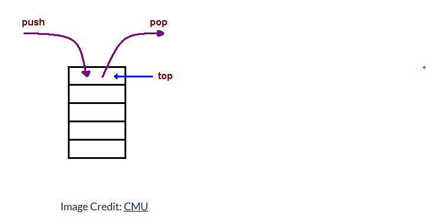

# Class 10 Reading Note

What is a ‘call’?

- Primarily used for function invocation.

How many ‘calls’ can happen at once?

- only once at a time.

What does LIFO mean?

- Last In, First Out, the last function that gets pushed into the stack is the first to be pop out, when the function returns.

Draw an example of a call stack and the functions that would need to be invoked to generate that call stack.

-   

What causes a Stack Overflow?

- It occurs when there is a recursive function without an exit point.

Reference [Understanding the JavaScript Call Stack](https://www.freecodecamp.org/news/understanding-the-javascript-call-stack-861e41ae61d4)  

What is a ‘reference error’?

- It occurs when you try to use a variable that is not yet declared.

What is a ‘syntax error’?

- It occurs when you have something that cannot be parsed in terms of syntax.

What is a ‘range error’?

- It occurs when you try to manipulate an object with some kind of length and give it an invalid length.

What is a ‘type error’?

- It occurs when the types you are trying to use or access are incompatible.

What is a breakpoint?

- It makes your program stop at that point only if a condition is met, it can be achieved by putting a debugger statement in your code in the line you want to break.

What does the word ‘debugger’ do in your code?

- It finds the exact point where you made a programming mistake.

Reference [JavaScript error messages](https://codeburst.io/javascript-error-messages-debugging-d23f84f0ae7c)  

[Back to Home](../../README.md)  
