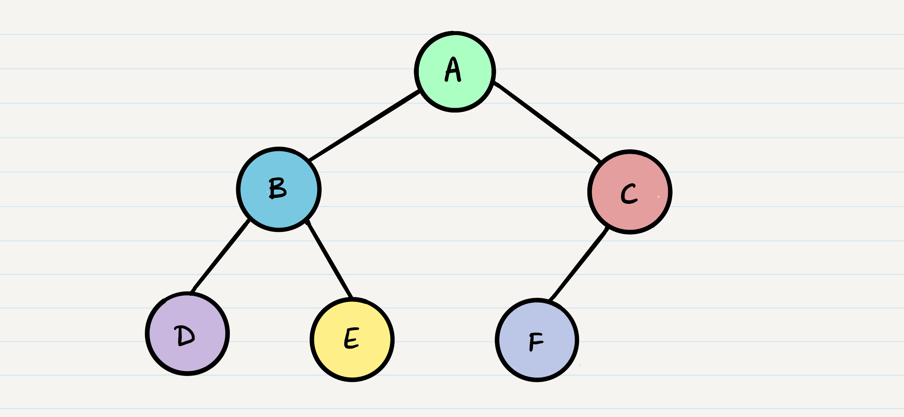
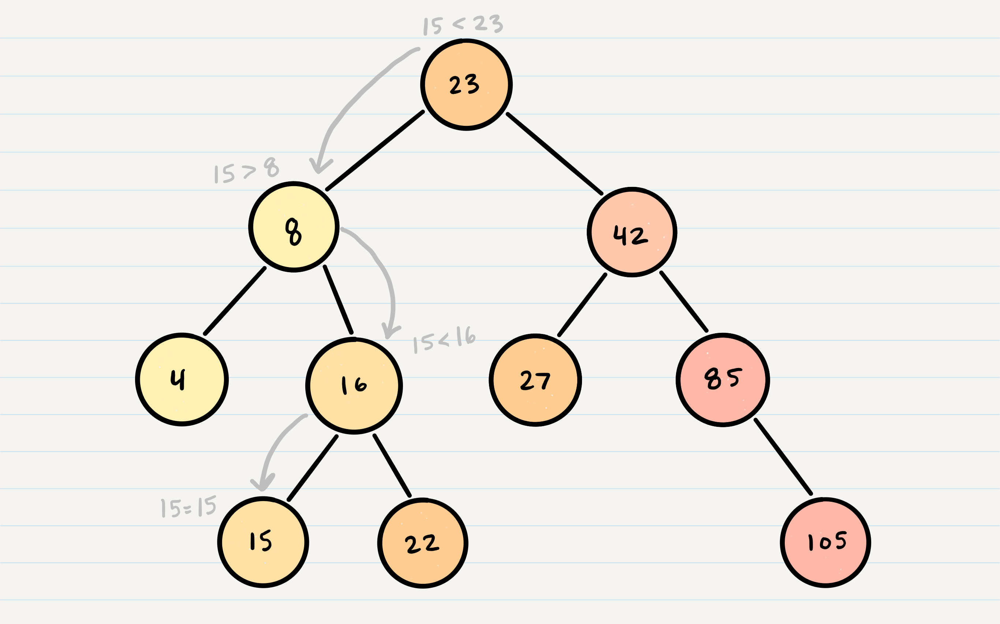

# Class 15 Reading Note

## Trees

***Common Terminology***  

- Node => A Tree node is a component which may contain its own values, and references to other nodes
- Root => The root is the node at the beginning of the tree
- K => A number that specifies the maximum number of children any node may have in a k-ary tree. In a binary tree, k = 2.
- Left => A reference to one child node, in a binary tree
- Right => A reference to the other child node, in a binary tree
- Edge => The edge in a tree is the link between a parent and child node
- Leaf => A leaf is a node that does not have any children
- Height => The height of a tree is the number of edges from the root to the furthest leaf

## Traversals

An important aspect of trees is how to traverse them. Traversing a tree allows us to search for a node, print out the contents of a tree, and much more! There are two categories of traversals when it comes to trees:

- Depth First
- Breadth First

***Depth First***  

Depth first traversal is where we prioritize going through the depth (height) of the tree first. There are multiple ways to carry out depth first traversal, and each method changes the order in which we search/print the root. Here are three methods for depth first traversal:

- Pre-order: root >> left >> right
- In-order: left >> root >> right
- Post-order: left >> right >> root



- Pre-order: A, B, D, E, C, F
- In-order: D, B, E, A, F, C
- Post-order: D, E, B, F, C, A

Pre-order means that the root has to be looked at first. In this case, A would be our root. Then it checks left and right:  

```
ALGORITHM preOrder(root)

  OUTPUT <-- root.value

  if root.left is not NULL
      preOrder(root.left)

  if root.right is not NULL
      preOrder(root.right)
```

When it reaches the bottom, it comes back to the root then it checks the other side. Same process as it did on the left.

And here are other two's codes that how to check the trees.  

```
ALGORITHM inOrder(root)
// INPUT <-- root node
// OUTPUT <-- in-order output of tree node's values

    if root.left is not NULL
        inOrder(root.left)

    OUTPUT <-- root.value

    if root.right is not NULL
        inOrder(root.right)
```

```
ALGORITHM postOrder(root)
// INPUT <-- root node
// OUTPUT <-- post-order output of tree node's values

    if root.left is not NULL
        postOrder(root.left)

    if root.right is not NULL
        postOrder(root.right)

    OUTPUT <-- root.value
```

***Breadth First***  

Breadth first traversal iterates through the tree by going through each level of the tree node-by-node.  

.png)  

Output: A, B, C, D, E, F

Traditionally, breadth first traversal uses a queue (instead of the call stack via recursion) to traverse the width/breadth of the tree.  

```
ALGORITHM breadthFirst(root)
// INPUT  <-- root node
// OUTPUT <-- front node of queue to console

  Queue breadth <-- new Queue()
  breadth.enqueue(root)

  while ! breadth.is_empty()
    node front = breadth.dequeue()
    OUTPUT <-- front.value

    if front.left is not NULL
      breadth.enqueue(front.left)

    if front.right is not NULL
      breadth.enqueue(front.right)
```

## Binary Tree Vs K-ary Trees

***Binary Tree***  

In all of our examples, we’ve been using a Binary Tree. Trees can have any number of children per node, but Binary Trees restrict the number of children to two (hence our left and right children).  

***K-ary Trees***  

If Nodes are able have more than 2 child nodes, we call the tree that contains them a K-ary Tree. In this type of tree we use K to refer to the maximum number of children that each Node is able to have.  

***Breadth First Traversal***  

Traversing a K-ary tree requires a similar approach to the breadth first traversal. We are still pushing nodes into a queue, but we are now moving down a list of children of length k, instead of checking for the presence of a left and a right child. Basically, we are now enqueue the children first then dequeue parent one by one.  

## Binary Search Trees

A Binary Search Tree (BST) is a type of tree that does have some structure attached to it. In a BST, nodes are organized in a manner where all values that are smaller than the root are placed to the left, and all values that are larger than the root are placed to the right.


***Searching a BST ***  

Searching a BST can be done quickly, because all you do is compare the node you are searching for against the root of the tree or sub-tree. If the value is smaller, you only traverse the left side. If the value is larger, you only traverse the right side.

Let’s say we are searching 15. We start by comparing the value 15 to the value of the root, 23.

15 < 23, so we traverse the left side of the tree. We then treat 8 as our new “root” to compare against.

15 > 8, so we traverse the right side. 16 is our new root.

15 < 16, so we traverse the left side. And aha! 15 is our new root and also a match with what we were searching for.

  

## Big O

The Big O time complexity of a Binary Search Tree’s insertion and search operations is O(h), or O(height). In the worst case, we will have to search all the way down to a leaf, which will require searching through as many nodes as the tree is tall. In a balanced (or “perfect”) tree, the height of the tree is log(n). In an unbalanced tree, the worst case height of the tree is n.

The Big O space complexity of a BST search would be O(1). During a search, we are not allocating any additional space.  

Reference [Trees](https://codefellows.github.io/common_curriculum/data_structures_and_algorithms/Code_401/class-15/resources/Trees.html)  

### Things that I want to know more about

What can we make using this trees? Is there anyway that we can apply these into our real world? If so, how or what can we apply these in our real world?

[Back to Home](../../README.md)
